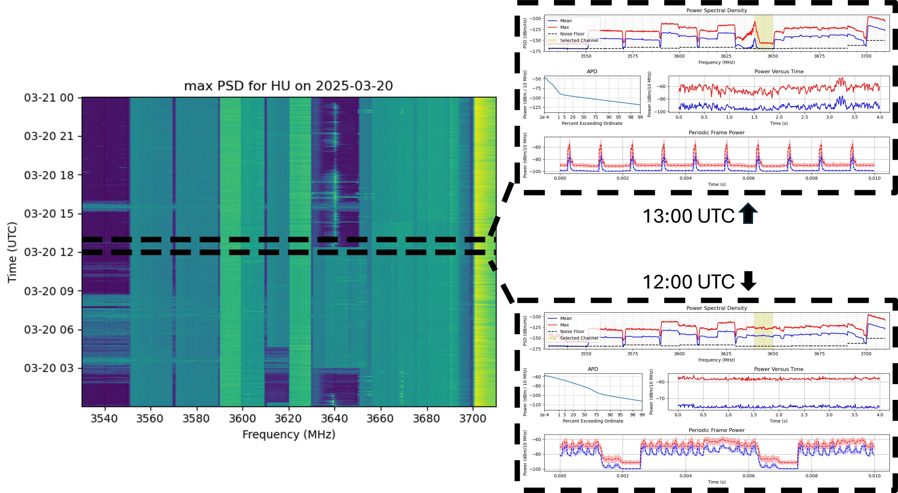

# SEA-DATA
Data Access Instructions for The NASCTN CBRS SEA program. 
1. Email [nasctn@nist.gov](mailto:nasctn@nist.gov) with a data request. Almost all requests are granted. 
2. The data is hosted by BOX at [SEA-DATA](https://nist.box.com/s/kit1ez4gktqivx66jmnlq7b873hhg0jc), you must be invited to use this link. You will be invited when you send the above email an address. 

# Data And Publications of Interest
1. [NASCTN CBRS SEA Website](https://www.nist.gov/programs-projects/cbrs-sharing-ecosystem-assessment)
2. [NASCTN CBRS SEA Data Manual](https://nvlpubs.nist.gov/nistpubs/TechnicalNotes/NIST.TN.2359.pdf) - NIST Technote 2359
3. [NASCTN CBRS SEA Sensor Development](https://www.mitre.org/sites/default/files/2026-01/PR-25-3159-spectrum-monitoring-sensor-radio-service-assessment.pdf)

# Sensor Locations

# Example Data
